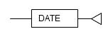

Chapter 3 Data Types
---

The following data types are supported:

 - DATE

### 3.1 DATE

**Syntax**

Specify the DATE type as follows.

|Data type syntax|Explanation|
|:---|:---|
|DATE|Stores date and time|

**General rules**

 - DATE is a date/time data type.
 - Date and time are stored in DATE. The time zone is not stored.

**Note**

----

If the DATE type of orafce is used in DDL statements such as table definitions, always set search_path before executing a DDL statement. Even if search_path is changed after definition, the data type will be the DATE type of OpenGauss.

----

**Information**

----

The DATE type of orafce is equivalent to the TIMESTAMP type of OpenGauss. Therefore, of the existing functions of OpenGauss, functions for which the data type of the argument is TIMESTAMP can be used.

----

