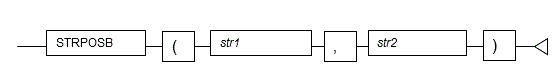

Chapter 6 Notes on Using orafce
---

This chapter provides notes on using Oracle database compatibility features added by orafce.

### 6.1 Functions
This section explains how to migrate functions added by orafce.

#### 6.1.1 INSTRB
**Description**

INSTRB searches for a substring in a string and returns the start position (in bytes) of the first occurrence of the substring.
##### 6.1.1.1 Obtaining the Start Position of a Substring (in Bytes)
**Functional differences**

 - **Oracle database**
     - INSTRB searches for a substring in a string and returns the start position (in bytes) of the substring.
 - **OpenGauss**
     - There is no INSTRB function. Use STRPOSB instead. STRPOSB is unique to orafce.

**Migration procedure**

Use the following procedure to migrate to STRPOSB:

 1. Search for the keyword INSTRB and identify where it is used.
 2. Confirm that arguments up to the second argument are specified.
 3. Change INSTRB to STRPOSB.

**Migration example**

The example below shows migration when searching for a particular substring in a string, and returning the start position of the substring in bytes.

<table>
<thead>
<tr>
<th align="center">Oracle database</th>
<th align="center">OpenGauss</th>
</tr>
</thead>
<tbody>
<tr>
<td align="left">
<pre><code>SELECT c_code, <b>INSTRB</b>( c_address, ',' ) 
  FROM company_table;</code></pre>
</td>

<td align="left">
<pre><code>SELECT c_code, <b>STRPOSB</b>( c_address, ',' ) 
  FROM company_table;</code></pre>
</td>
</tr>
</tbody>
</table>

**Note**

----

If the third argument is specified in INSTRB, refer to the conversion example shown below. If the fourth argument is specified, migration is not possible.

----

**Information**

----

The general rules for STRPOSB are as follows:

----

**Description**

INSTRB returns the start position (in bytes) of a substring within a string.

**Specification format**

**General rules**

 - STRPOSB searches for string *str2* in *str1* and returns the start position it finds in bytes.
 - If *str2* is not found, 0 is returned.
 - The data type of the return value is INTEGER.

##### 6.1.1.2 Obtaining the Start Position of a Substring from a Specified Search Start Position (in Bytes)

**Functional differences**

 - **Oracle database**
     - The search start position is specified in the third argument of INSTRB.
 - **OpenGauss**
     - A search start position cannot be specified with STRPOSB.

**Migration procedure**

A search start position cannot be specified, so truncate the search target string to the start position so that the same result is returned. Use the following procedure to perform migration:

 1. Search for the keyword INSTRB and identify where it is used.
 2. Confirm that arguments up to the third argument are specified and that a positive number is specified.
 3. Enclose the string specified in the first argument with SUBSTRB, and specify the value specified in the third argument of INSTRB as the second argument of SUBSTRB.
 4. Change INSTRB to STRPOSB and delete the value specified in the third argument.
 5. Enclose the function in a simple CASE expression to evaluate the result of the function changed in step 4.   Define the selector so that 0 is returned when the result is 0.   If the result is not 0, specify the same function as in step 4, and add the value obtained by subtracting 1 from the value specified in the second argument of SUBSTRB.

**Migration example**

The example below shows migration when a search start position is specified and then the start position of a string is found in bytes.

<table>
<thead>
<tr>
<th align="center">Oracle database</th>
<th align="center">OpenGauss</th>
</tr>
</thead>
<tbody>
<tr>
<td align="left">
<pre><code>SELECT c_code, <b>INSTRB( c_address, '-', 10 )</b> 
 FROM company_table; 
 
 
 
 
 </code></pre>
</td>

<td align="left">
<pre><code>SELECT c_code, 
 <b>CASE STRPOSB( SUBSTRB( c_address, 10 ),'-') 
 WHEN 0 THEN 0 
 ELSE STRPOSB( SUBSTRB( c_address, 10 ), '-' ) + 9 
 END</b> 
 FROM company_table;</code></pre>
</td>
</tr>
</tbody>
</table>

#### 6.1.2 INSTRC, INSTR2, and INSTR4

**Description**

INSTRC, INSTR2, and INSTR4 return the start position of a substring in a string using the relevant encoding.

**Functional differences**

 - **Oracle database**
     - INSTRC, INSTR2, and INSTR4 use the relevant encoding to search for a substring in a string from a specified position and then return the start position of the substring.
 - **OpenGauss**
     - There are no INSTRC, INSTR2, and INSTR4 functions. Only Unicode encoding is used in OpenGauss.

**Migration procedure**

Use the following procedure to migrate to INSTR:

 1. Search for the keywords INSTRC, INSTR2, and INSTR4, and identify where they are used.
 2. Change those keywords to INSTR.

**Migration example**

The example below shows migration from INSTRC, INSTR2, and INSTR4.

<table>
<thead>
<tr>
<th align="center">Oracle database</th>
<th align="center">OpenGauss</th>
</tr>
</thead>
<tbody>
<tr>
<td align="left">
<pre><code> SELECT c_name, <b>INSTRC</b>( c_name, 'Corp', 2, 1 ) 
  FROM company_table; 
 
 SELECT c_name, <b>INSTR2</b>( c_name, 'Corp', 2, 1 ) 
  FROM company_table; 
 
 SELECT c_name, <b>INSTR4</b>( c_name, 'Corp', 2, 1 ) 
  FROM company_table;</code></pre>
</td>

<td align="left">
<pre><code>SELECT c_name, <b>INSTR</b>( c_name, 'Corp', 2, 1 ) 
  FROM company_table; 
 
 
 
 
 
 
 </code></pre>
</td>
</tr>
</tbody>
</table>

#### 6.1.3 LENGTHC, LENGTH2, and LENGTH4

**Description**

LENGTHC, LENGTH2, and LENGTH4 use the relevant encoding to return the length of the specified string.

**Functional differences**

 - **Oracle database**
     - LENGTHC, LENGTH2, and LENGTH4 use the relevant encoding to return the length of the specified string.
 - **OpenGauss**
     - There are no LENGTHC, LENGTH2, and LENGTH4 functions. Only Unicode encoding is used in OpenGauss.

**Migration procedure**

Use the following procedure to migrate to LENGTH:

 1. Search for the keywords LENGTHC, LENGTH2, and LENGTH4, and identify where they are used.
 2. Change those keywords to LENGTH.

**Migration example**

The example below shows migration from LENGTHC, LENGTH2, and LENGTH4.

<table>
<thead>
<tr>
<th align="center">Oracle database</th>
<th align="center">OpenGauss</th>
</tr>
</thead>
<tbody>
<tr>
<td align="left">
<pre><code> SELECT name, <b>LENGTHC</b>( name ) 
  FROM staff_table 
  WHERE job = 'sales member'; 
 
 SELECT name, <b>LENGTH2</b>( name ) 
  FROM staff_table 
  WHERE job = 'sales member'; 
 
 SELECT name, <b>LENGTH4</b>( name ) 
  FROM staff_table 
  WHERE job = 'sales member';</code></pre>
</td>

<td align="left">
<pre><code> SELECT name, <b>LENGTH</b>( name ) 
  FROM staff_table 
  WHERE job = 'sales member'; 
 
 
 
 
 
 
 
 
 </code></pre>
</td>
</tr>
</tbody>
</table>

#### 6.1.4 SUBSTRC, SUBSTR2, and SUBSTR4

**Description**

SUBSTRC, SUBSTR2, and SUBSTR4 extract part of a string in the character unit of the relevant encoding.

**Functional differences**

 - **Oracle database**
     - SUBSTRC, SUBSTR2, and SUBSTR4 extract part of a string in the character unit of the relevant encoding.
 - **OpenGauss**
     - There are no SUBSTRC, SUBSTR2, and SUBSTR4 functions. Only Unicode encoding is used in OpenGauss.

**Migration procedure**

Use the following procedure to migrate to SUBSTR:

 1. Search for the keywords SUBSTRC, SUBSTR2, and SUBSTR4, and identify where they are used.
 2. Change those keywords to SUBSTR.

**Migration example**

The example below shows migration when part of a string is extracted in the character unit of the relevant encoding.

<table>
<thead>
<tr>
<th align="center">Oracle database</th>
<th align="center">OpenGauss</th>
</tr>
</thead>
<tbody>
<tr>
<td align="left">
<pre><code> SELECT <b>SUBSTRC</b>( c_telephone, 5, 8 ) 
  FROM company_table; 
 
 SELECT <b>SUBSTR2</b>( c_telephone, 5, 8 ) 
 FROM company_table; 
 
 SELECT <b>SUBSTR4</b>( c_telephone, 5, 8 ) 
  FROM company_table;</code></pre>
</td>

<td align="left">
<pre><code> SELECT <b>SUBSTR</b>( c_telephone, 5, 8 ) 
  FROM company_table; 
 
 
 
 
 
 
 </code></pre>
</td>
</tr>
</tbody>
</table>

#### 6.1.5 SUBSTRB
**Description**

SUBSTRB extracts part of a string in bytes.

##### 6.1.5.1 Specifying Zero as the Start Position
**Functional differences**

 - **Oracle database**
     - If 0 is specified as the start position, the part of the string is extracted from the first byte.
 - **OpenGauss**
     - If 0 is specified as the start position, extraction starts at the position found by subtracting 1 from the start position and shifting by that number of positions to the left.

**Migration procedure**

Use the following procedure to perform migration:

 1. Search for the keyword SUBSTRB and identify where it is used.
 2. If 0 is specified as the start position, change it to 1.

**Migration example**

The example below shows migration when 0 is specified as the start position for SUBSTRB.

<table>
<thead>
<tr>
<th align="center">Oracle database</th>
<th align="center">OpenGauss</th>
</tr>
</thead>
<tbody>
<tr>
<td align="left">
<pre><code> SELECT SUBSTRB( c_telephone, <b>0</b>, 7 ) &#124;&#124; '-xxxx' 
  FROM company_table;</code></pre>
</td>

<td align="left">
<pre><code> SELECT SUBSTRB( c_telephone, <b>1</b>, 7 ) &#124;&#124; '-xxxx' 
  FROM company_table;</code></pre>
</td>
</tr>
</tbody>
</table>

##### 6.1.5.2 Specifying a Negative Value as the Start Position
**Functional differences**

 - **Oracle database**
     - If a negative value is specified as the start position, extraction starts at the position found by counting by that number of bytes after the end of the string.
 - **OpenGauss**
     - If a negative value is specified as the start position, extraction starts at the position found by subtracting 1 from the start position and shifting by that number of positions to the left.

**Migration procedure**

Use the following procedure to perform migration:

 1. Search for the keyword SUBSTRB and identify where it is used.
 2. If a negative value is specified as the start position, add (OCTET_LENGTH(firstArgumentOfSubstrb)+1) before the negative value of the start position parameter.

**Migration example**

The example below shows migration when a negative value is specified as the start position for SUBSTRB.

<table>
<thead>
<tr>
<th align="center">Oracle database</th>
<th align="center">OpenGauss</th>
</tr>
</thead>
<tbody>
<tr>
<td align="left">
<pre><code> SELECT 'xxx-' &#124;&#124; 
        SUBSTRB( c_telephone, <b>-8</b>, 3 ) &#124;&#124; 
        '-xxxx' 
 FROM company_table; 
 
 
 
 </code></pre>
</td>

<td align="left">
<pre><code>SELECT 'xxx-' &#124;&#124; 
        SUBSTRB( c_telephone, 
                 ( <b>OCTET_LENGTH( c_telephone )  
                    +1 ) -8</b>, 
                   3 ) &#124;&#124; 
        '-xxxx' 
  FROM company_table;</code></pre>
</td>
</tr>
</tbody>
</table>

##### 6.1.5.3 Specifying a Value Less Than One as the String Length
**Functional differences**

 - **Oracle database**
     - If a value less than 1 is specified as the string length, NULL is returned.
 - **OpenGauss**
     - If the string length is 0, a null character is returned. A negative value cannot be specified as a string length.

**Migration procedure**

Use the following procedure to perform migration. Note that the final step depends on whether NULL or a null character is expected as the return value.

 - When expecting NULL as the return value
     1. Search for the keyword SUBSTRB and identify where it is used.
     2. Confirm that a value less than 1 is specified in the string length parameter.
     3. Change the string length to NULL.
 - When expecting a null character as the return value
     1. Search for the keyword SUBSTRB and identify where it is used.
     2. Confirm that a value less than 1 is specified in the string length parameter.
     3. If a value less than 0 is specified as the string length, change it to 0.

**Migration example**

The example below shows migration when a value less than 1 is specified as the string length in SUBSTRB. In this example, NULL is expected as the return value.

<table>
<thead>
<tr>
<th align="center">Oracle database</th>
<th align="center">OpenGauss</th>
</tr>
</thead>
<tbody>
<tr>
<td align="left">
<pre><code> SELECT SUBSTRB( c_telephone, 1, <b>-1</b> ) 
  FROM company_table;</code></pre>
</td>

<td align="left">
<pre><code> SELECT SUBSTRB( c_telephone, 1, <b>NULL</b> ) 
  FROM company_table;</code></pre>
</td>
</tr>
</tbody>
</table>

#### 6.1.6 Functions Requiring Parentheses

Some functions added by orafce do not have arguments. Parentheses must be added to these functions when they are called. The functions to which parentheses must be added are listed below.
Functions requiring parentheses:

 - SYSDATE
 - SESSIONTIMEZONE
 - DBTIMEZONE

**Migration example**

The example below shows migration when a function that has no arguments is called.

<table>
<thead>
<tr>
<th align="center">Oracle database</th>
<th align="center">OpenGauss</th>
</tr>
</thead>
<tbody>
<tr>
<td align="left">
<pre><code> SELECT <b>SYSDATE</b> FROM DUAL;</code></pre>
</td>

<td align="left">
<pre><code> SELECT <b>SYSDATE()</b> FROM DUAL;</code></pre>
</td>
</tr>
</tbody>
</table>

### 6.2 Standard Packages

This section explains how to migrate the standard packages added by orafce.

#### 6.2.1 DBMS_ASSERT

**Description**

The DBMS_ASSERT package checks and normalizes SQL syntax elements.

##### 6.3.2.1 DBMS_ASSERT.ENQUOTE_LITERAL

**Functional differences**

 - **Oracle database**
     - If a string in an argument is already enclosed in single quotation marks, it is not again enclosed in single quotation marks.
 - **OpenGauss**
     - Even if a string in an argument is already enclosed in single quotation marks, it is again enclosed in single quotation marks.

**Migration procedure**

Use the following procedure to perform migration:

 1. Search for the keyword DBMS_ASSERT.ENQUOTE_LITERAL and identify where it is used.
 2. In the conditions of an IF statement, use LEFT and RIGHT to check the leading and trailing characters.
 3. If each result does not match a single quotation mark (E'\x27'), use ENQUOTE_LITERAL to replace it.

**Migration example**

The example below shows migration when a string is enclosed in single quotation marks.

<table>
<thead>
<tr>
<th align="center">Oracle database</th>
<th align="center">OpenGauss</th>
</tr>
</thead>
<tbody>
<tr>
<td align="left">
<pre><code> DBMS_OUTPUT.PUT_LINE( 
  DBMS_ASSERT.ENQUOTE_LITERAL( en_lit ) ); 
 
 
 
 
 </code></pre>
</td>

<td align="left">
<pre><code> <b>IF ( LEFT( en_lit, 1 ) = E'\x27' AND 
      RIGHT( en_lit, 1 ) = E'\x27' ) THEN 
   PERFORM DBMS_OUTPUT.PUT_LINE( en_lit ); 
 ELSE</b> 
  PERFORM DBMS_OUTPUT.PUT_LINE( 
   DBMS_ASSERT.ENQUOTE_LITERAL( en_lit ) ); 
 <b>END IF;</b></code></pre>
</td>
</tr>
</tbody>
</table>

**Note**

----

OpenGauss does not verify single quotation marks.

----

##### 6.3.2.2 DBMS_ASSERT.ENQUOTE_NAME

**Functional differences**

 - **Oracle database**
     - If the string in the first argument is already enclosed in double quotation marks, it is not again enclosed in double quotation marks.   In addition, regardless of whether there is a second argument, a string enclosed in double quotation marks is not converted from lowercase to uppercase.
 - **OpenGauss**
     - Even if the string in the first argument is already enclosed in double quotation marks, it is again enclosed in double quotation marks.   However, a first argument string that is all in lowercase is not enclosed in double quotation marks.  In addition, if the second argument is set to TRUE or the default, it is converted from uppercase to lowercase even if it is enclosed in double quotation marks.

**Migration procedure**

Use the following procedure to perform migration:

 1. Search for the keyword DBMS_ASSERT.ENQUOTE_NAME and identify where it is used.
 2. In the conditions of an IF statement, use LEFT and RIGHT to check the leading and trailing characters.
 3. If each result does not match a double quotation mark (E'\x27'), use ENQUOTE_NAME to replace it.

**Migration example**

The example below shows migration when a string is enclosed in double quotation marks.

<table>
<thead>
<tr>
<th align="center">Oracle database</th>
<th align="center">OpenGauss</th>
</tr>
</thead>
<tbody>
<tr>
<td align="left">
<pre><code> DBMS_OUTPUT.PUT_LINE( 
  DBMS_ASSERT.ENQUOTE_NAME( en_nam ) ); 
 
 
 
 
  </code></pre>
</td>

<td align="left">
<pre><code> <b>IF ( LEFT( en_nam, 1 ) = E'\x22' AND 
      RIGHT( en_nam, 1 ) = E'\x22' ) THEN 
   PERFORM DBMS_OUTPUT.PUT_LINE( en_nam ); 
 ELSE</b> 
  PERFORM DBMS_OUTPUT.PUT_LINE( 
   DBMS_ASSERT.ENQUOTE_NAME( en_nam ) ); 
 <b>END IF;</b></code></pre>
</td>
</tr>
</tbody>
</table>

##### 6.3.2.3 DBMS_ASSERT.SIMPLE_SQL_NAME

**Functional differences**

 - **Oracle database**
     - If the leading or trailing position of a string in an argument contains a space, the space is deleted before the string is evaluated.
 - **OpenGauss**
     - If the leading or trailing position of a string in an argument contains a space, the string is evaluated as is, causing an error.

**Migration procedure**

Use the following procedure to perform migration:

 1. Search for the keyword DBMS_ASSERT.SIMPLE_SQL_NAME and identify where it is used.
 2. If the leading or trailing position of a string in an argument contains a space, use TRIM to delete the space immediately preceding or following the argument string.

**Migration example**

The example below shows migration when the leading or trailing position of a string in an argument contains a space.

<table>
<thead>
<tr>
<th align="center">Oracle database</th>
<th align="center">OpenGauss</th>
</tr>
</thead>
<tbody>
<tr>
<td align="left">
<pre><code>DBMS_OUTPUT.PUT_LINE( 
  DBMS_ASSERT.SIMPLE_SQL_NAME( si_nam ) ); 
  </code></pre>
</td>

<td align="left">
<pre><code> PERFORM DBMS_OUTPUT.PUT_LINE( 
  DBMS_ASSERT.SIMPLE_SQL_NAME( 
   <b>TRIM( both from si_nam )</b> ) );</code></pre>
</td>
</tr>
</tbody>
</table>

**See**

----

The strings checked by DBMS_ASSERT.SIMPLE_SQL_NAME correspond to identifiers among the SQL elements. Refer to "The SQL Language" > "Lexical Structure" > "Identifiers and Key Words" in the OpenGauss Documentation for information on the values that can be used as identifiers in OpenGauss.

----

##### 6.3.2.4 DBMS_ASSERT.SQL_OBJECT_NAME
**Functional differences**

 - **Oracle database**
     - DBMS_ASSERT.SQL_OBJECT_NAME exists.
 - **OpenGauss**
     - DBMS_ASSERT.SQL_OBJECT_NAME does not exist. Use DBMS_ASSERT.OBJECT_NAME instead.

**Migration procedure**

Use the following procedure to perform migration:

 1. Search for the keyword DBMS_ASSERT.SQL_OBJECT_NAME and identify where it is used.
 2. Change DBMS_ASSERT.SQL_OBJECT_NAME to DBMS_ASSERT.OBJECT_NAME.

**Migration example**

The example below shows migration when an input value is verified as a qualified SQL identifier of an existing SQL object.

<table>
<thead>
<tr>
<th align="center">Oracle database</th>
<th align="center">OpenGauss</th>
</tr>
</thead>
<tbody>
<tr>
<td align="left">
<pre><code> SELECT 
   DBMS_ASSERT.<b>SQL_OBJECT_NAME</b>( 'inventory_table' ) 
  INTO table_name 
  FROM DUAL;</code></pre>
</td>

<td align="left">
<pre><code> SELECT 
   DBMS_ASSERT.<b>OBJECT_NAME</b>( 'inventory_table' ) 
  INTO table_name 
  FROM DUAL;</code></pre>
</td>
</tr>
</tbody>
</table>

##### 6.3.2.5 Example of Migrating DBMS_ASSERT
The example below shows migration to PL/pgSQL when DBMS_ASSERT is used.

<table>
<thead>
<tr>
<th align="center">Oracle database</th>
<th align="center">OpenGauss</th>
</tr>
</thead>
<tbody>
<tr>
<td align="left">
<pre><code> SET SERVEROUTPUT ON 
 DECLARE 
  en_lit VARCHAR2(50) := '''ENQUOTE_LITERAL'''; 
  en_nam VARCHAR2(50) := '"enquote_name"'; 
  si_nam VARCHAR2(50) := ' SIMPLE_SQL_NAME   '; 
  table_name VARCHAR2(20); 
 BEGIN 
 
  DBMS_OUTPUT.PUT_LINE( 
   DBMS_ASSERT.ENQUOTE_LITERAL( en_lit )); 
 
 
 
 
 
 
  DBMS_OUTPUT.PUT_LINE( 
   DBMS_ASSERT.ENQUOTE_NAME( en_nam )); 
 
 
 
 
 
 
  DBMS_OUTPUT.PUT_LINE( 
   DBMS_ASSERT.SIMPLE_SQL_NAME( si_nam )); 
 
 
  SELECT DBMS_ASSERT.<b>SQL_OBJECT_NAME</b>( 
                     'inventory_table' ) 
  INTO table_name 
  FROM DUAL; 
  DBMS_OUTPUT.PUT_LINE( 
              'Object is : ' &#124;&#124; table_name ); 
 END; 
 / 
 </code></pre>
</td>

<td align="left">
<pre><code> DO $$ 
 DECLARE 
  en_lit VARCHAR2(50) := '''ENQUOTE_LITERAL''';  
  en_nam VARCHAR2(50) := '"enquote_name"';  
  si_nam VARCHAR2(50) := ' SIMPLE_SQL_NAME   ';  
  table_name VARCHAR2(20);  
 BEGIN 
  PERFORM DBMS_OUTPUT.SERVEROUTPUT(TRUE);  
  <b>IF ( LEFT( en_lit, 1 ) = E'\x27' AND 
       RIGHT( en_lit, 1 ) = E'\x27' ) THEN 
   PERFORM DBMS_OUTPUT.PUT_LINE( en_lit );  
  ELSE</b> 
   PERFORM DBMS_OUTPUT.PUT_LINE( 
    DBMS_ASSERT.ENQUOTE_LITERAL( en_lit )); 
  <b>END IF;</b> 
 
  <b>IF ( LEFT( en_nam, 1 ) = E'\x22' AND 
       RIGHT( en_nam, 1 ) = E'\x22' ) THEN 
   PERFORM DBMS_OUTPUT.PUT_LINE( en_nam ); 
  ELSE</b> 
   PERFORM DBMS_OUTPUT.PUT_LINE( 
    DBMS_ASSERT.ENQUOTE_NAME( en_nam ) ); 
  <b>END IF; </b> 
 
  PERFORM DBMS_OUTPUT.PUT_LINE( 
   DBMS_ASSERT.SIMPLE_SQL_NAME( 
                       <b>TRIM( both from si_nam ) ) );</b> 
 
  SELECT DBMS_ASSERT.<b>OBJECT_NAME</b>( 
                     'inventory_table' ) 
   INTO table_name 
   FROM DUAL; 
  PERFORM DBMS_OUTPUT.PUT_LINE( 
                      'Object is : ' &#124;&#124; table_name ); 
 END; 
 $$ 
 ;  </code></pre>
</td>
</tr>
</tbody>
</table>

#### 6.2.2 DBMS_OUTPUT
**Description**

The DBMS_OUTPUT package sends messages from PL/pgSQL to clients such as psql.

##### 6.3.3.1 Differences in the Timing of Output Immediately After DBMS_OUTPUT.SERVEROUTPUT Changes from OFF to ON

**Functional differences**

 - **Oracle database**
     - Messages stored in the buffer while SERVEROUTPUT is OFF are displayed after the execution of the first SQL statement or anonymous PL/SQL after SERVEROUTPUT changes to ON.
 - **OpenGauss**
     - Messages stored in the buffer while SERVEROUTPUT is FALSE are not displayed even after the execution of the first SQL statement or anonymous block after SERVEROUTPUT changes to TRUE. DBMS_OUT.NEW_LINE must be executed.

**Migration procedure**

Use the following procedure to perform migration:
 1. Search for the keyword SERVEROUTPUT and identify where it changes from OFF to ON.
 2. Change the code so that DBMS_OUT.NEW_LINE is executed immediately after the SQL statement or anonymous block that is executed after the SERVEROUTPUT statement is changed to ON.

**Migration example**

The example below shows migration when the status of SERVEROUTPUT changes.

<table>
<thead>
<tr>
<th align="center">Oracle database</th>
<th align="center">OpenGauss</th>
</tr>
</thead>
<tbody>
<tr>
<td align="left">
<pre><code> SET SERVEROUTPUT OFF; 
 
 
 
 
 
 ... 
 
 <b>SET SERVEROUTPUT ON;</b> 
 SELECT * FROM dual; 
 
 
 
 
 
 </code></pre>
</td>

<td align="left">
<pre><code> DO $$ 
 BEGIN 
 PERFORM DBMS_OUTPUT.SERVEROUTPUT( FALSE ); 
 END; 
 $$ 
 ; 
 ... 
 
 SELECT * FROM dual; 
 <b>DO $$ 
 BEGIN 
  PERFORM DBMS_OUTPUT.SERVEROUTPUT( TRUE );  
  PERFORM DBMS_OUTPUT.NEW_LINE(); 
 END; 
 $$ 
 ;</b> 
 </code></pre>
</td>
</tr>
</tbody>
</table>

##### 6.3.3.2 Other Notes on Using DBMS_OUTPUT

This section explains the functional differences to be noted when DBMS_OUTPUT is used. Note that PL/pgSQL features cannot migrate these functional differences. Consider, for example, changing the application logic.

###### 6.3.3.2.1 Differences in the Output Timing of DBMS_OUTPUT.PUT_LINE and DBMS_OUTPUT.NEW_LINE

**Functional differences**

 - **Oracle database**
     - When SERVEROUTPUT is ON, the outputs of DBMS_OUTPUT.PUT_LINE and DBMS_OUTPUT.NEW_LINE are displayed together after the procedure finishes.   These outputs are stored in the buffer of the server while the procedure is running.
 - **OpenGauss**
     - When SERVEROUTPUT is TRUE, the outputs from executing DBMS_OUTPUT.PUT_LINE and DBMS_OUTPUT.NEW_LINE are sent to the client and displayed immediately.   They are not stored in the buffer of the server.

##### 6.3.3.3 Example of Migrating DBMS_OUTPUT
The example below shows migration to PL/pgSQL when DBMS_OUTPUT is used.

<table>
<thead>
<tr>
<th align="center">Oracle database</th>
<th align="center">OpenGauss</th>
</tr>
</thead>
<tbody>
<tr>
<td align="left">
<pre><code> SET SERVEROUTPUT OFF; 
 BEGIN 
 
  DBMS_OUTPUT.ENABLE( NULL ); 
  DBMS_OUTPUT.PUT_LINE( '1:Hello World' ); 
 END; 
 / 
 
 <b>SET SERVEROUTPUT ON</b> 
 SELECT * FROM dual; 
 
 
 
 
 
 
 </code></pre>
</td>

<td align="left">
<pre><code> DO $$ 
 BEGIN 
  PERFORM DBMS_OUTPUT.SERVEROUTPUT( FALSE ); 
  PERFORM DBMS_OUTPUT.ENABLE( NULL ); 
  PERFORM DBMS_OUTPUT.PUT_LINE( '1:Hello World' ); 
 END; 
 $$ 
 ; 
 SELECT * FROM dual; 
 <b>DO $$ 
  BEGIN 
   PERFORM DBMS_OUTPUT.SERVEROUTPUT( TRUE ); 
   PERFORM DBMS_OUTPUT.NEW_LINE(); 
 END; 
 $$ 
 ;</b> </code></pre>
</td>
</tr>
</tbody>
</table>

#### 6.2.3 DBMS_PIPE
**Description**

The DBMS_PIPE package performs one-to-one communication between PL/pgSQL sessions.

##### 6.3.4.1 Differences from the DBMS_PIPE.CREATE_PIPE Definition
**Functional differences**

 - **Oracle database**
     - The second argument specifies the maximum size of the pipe in bytes. The default is 8192 bytes.   The third argument specifies the pipe type. The default is TRUE (private pipe).
 - **OpenGauss**
     - The second argument specifies the maximum number of messages that the pipe can hold. The default is 0. The specifiable range of numeric values is 1 to 32767.   The third argument specifies the pipe type. The default is FALSE (public pipe).

**Migration procedure**

Use the following procedure to perform migration:

 1. Search for the keyword DBMS_PIPE.CREATE_PIPE and identify where it is used.
 2. Change the code so that the maximum number of messages is specified in the second argument.
 3. If the third argument is omitted and a private pipe is to be created, specify TRUE in the third argument.

**Note**

----

Preferably, create a public pipe (the default) as the pipe type. If you create a private pipe, internal information (the creator of the private pipe) will remain even after the pipe is removed. Thus repeatedly creating and removing pipes may ultimately cause memory to run out.

----

**Migration example**

The example below shows migration of DBMS_PIPE.CREATE_PIPE.

<table>
<thead>
<tr>
<th align="center">Oracle database</th>
<th align="center">OpenGauss</th>
</tr>
</thead>
<tbody>
<tr>
<td align="left">
<pre><code> DBMS_PIPE.CREATE_PIPE( 
           'pipename', 
           <b>2000,  
           TRUE</b> );</code></pre>
</td>

<td align="left">
<pre><code> DBMS_PIPE.CREATE_PIPE( 
           'pipename', 
           <b>50, 
           TRUE</b> );</code></pre>
</td>
</tr>
</tbody>
</table>

##### 6.3.4.2 Return Values of DBMS_PIPE.CREATE_PIPE and DBMS_PIPE.REMOVE_PIPE
**Functional differences**

 - **Oracle database**
     - DBMS_PIPE.CREATE_PIPE and DBMS_PIPE.REMOVE_PIPE both return values.
 - **OpenGauss**
     - DBMS_PIPE.CREATE_PIPE and DBMS_PIPE.REMOVE_PIPE both do not return values.

**Migration procedure**

Use the following procedure to perform migration:

 1. Search for the keywords DBMS_PIPE.CREATE_PIPE and DBMS_PIPE.REMOVE_PIPE, and identify where they are used.
 2. Change the code so that the call processing identified in step 1 is called by the PERFORM keyword.
 3. If return values are used, replace the target processing with 0.

**Migration example**

The example below shows migration of DBMS_PIPE.CREATE_PIPE.

<table>
<thead>
<tr>
<th align="center">Oracle database</th>
<th align="center">OpenGauss</th>
</tr>
</thead>
<tbody>
<tr>
<td align="left">
<pre><code> <b>st := DBMS_PIPE.CREATE_PIPE( pipename, 2000 );</b> 
 DBMS_OUTPUT.PUT_LINE( 'Return Value =' &#124;&#124; st ); 
 
 </code></pre>
</td>

<td align="left">
<pre><code> <b>PERFORM DBMS_PIPE.CREATE_PIPE( pipename, 50 ); 
 st := 0;</b> 
 PERFORM DBMS_OUTPUT.PUT_LINE( 
                  'Return Value =' &#124;&#124; st );</code></pre>
</td>
</tr>
</tbody>
</table>

##### 6.3.4.3 Creating the Same Pipe Name with DBMS_PIPE.CREATE_PIPE
**Functional differences**

 - **Oracle database**
     - If a pipe with the same name already exists and can be used, DBMS_PIPE.CREATE_PIPE returns normally.
 - **OpenGauss**
     - If a pipe with the same name already exists, DBMS_PIPE.CREATE_PIPE returns with an error.

**Migration procedure**

Use the following procedure to perform migration:

 1. Search for the keyword CREATE_PIPE and identify where it is used.
 2. If there may be a pipe with the same name, use the PERFORM statement shown below to check if the same pipe exists.
 3. If NOT FOUND returns TRUE, there is no pipe with the same name, so execute CREATE_PIPE.

~~~
PERFORM 1
  FROM DBMS_PIPE.DB_PIPES
  WHERE NAME = nameOfPipeToBeCreated
~~~

**Migration example**

The example below shows migration of CREATE_PIPE when there may be a pipe with the same name.

<table>
<thead>
<tr>
<th align="center">Oracle database</th>
<th align="center">OpenGauss</th>
</tr>
</thead>
<tbody>
<tr>
<td align="left">
<pre><code>  
 DECLARE 
  pipename VARCHAR2(1000) := 'TESTPIPE01'; 
 BEGIN 
  <b>DBMS_OUTPUT.PUT_LINE( 
   'Return = '&#124;&#124; DBMS_PIPE.CREATE_PIPE( 
                           pipename, 
                           2000, 
                           TRUE ) );</b> 
 
 
 
 END; 
 / 
 </code></pre>
</td>

<td align="left">
<pre><code> DO $$ 
 DECLARE 
 pipename VARCHAR2(1000) := 'TESTPIPE01'; 
 BEGIN 
  <b>PERFORM 1 
   FROM DBMS_PIPE.DB_PIPES 
   WHERE NAME = pipename;  
  IF ( NOT FOUND ) THEN 
   PERFORM DBMS_PIPE.CREATE_PIPE( pipename, 
                                  50, 
                                  TRUE ); 
 END IF;</b> 
 END; 
 $$ 
 ;</code></pre>
</td>
</tr>
</tbody>
</table>

##### 6.3.4.4 Return Values of DBMS_PIPE.NEXT_ITEM_TYPE
**Functional differences**

 - **Oracle database**
     - DBMS_PIPE.NEXT_ITEM_TYPE has the following return values:   0: There is no next item.   6: NUMBER type   9: VARCHAR2 type   11: ROWID type   12: DATE type   23: RAW type
 - **OpenGauss**
     - DBMS_PIPE.NEXT_ITEM_TYPE has the following return values:   0: There is no next item.   9: NUMERIC type   11: TEXT type   12: DATE type   13: TIMESTAMP type   23: BYTEA type   24: RECORD type

**Migration procedure**

Use the following procedure to perform migration:

 1. Search for the keyword NEXT_ITEM_TYPE and identify the variable storing the return value of NEXT_ITEM_TYPE.
 2. If the return value of NEXT_ITEM_TYPE is determined, change it to the value in OpenGauss according to the table below.

**Correspondence of return values of DBMS_PIPE.NEXT_ITEM_TYPE**

|Oracle database|OpenGauss|
|:---|:---|
|	NUMBER type	|	NUMERIC type	|
|	VARCHAR2 type	|	TEXT type	|
|	ROWID type	|		|
|		|	DATE type	|
|	DATE type	|	TIMESTAMP type	|
|	RAW type	|	BYTEA type	|
|		|	RECORD type	|

**Migration example**

The example below shows migration when processing is branched according to the return value of DBMS_PIPE.NEXT_ITEM_TYPE.

<table>
<thead>
<tr>
<th align="center">Oracle database</th>
<th align="center">OpenGauss</th>
</tr>
</thead>
<tbody>
<tr>
<td align="left">
<pre><code> item := DBMS_PIPE.NEXT_ITEM_TYPE; 
 IF ( <b>item = 6</b> ) THEN  -- NUMBER type 
 ~ 
 ELSIF ( <b>item = 9</b> ) THEN -- VARCHAR2 type 
 ~ 
 ELSIF ( <b>item = 12</b> ) THEN  -- DATE type 
 ~</code></pre>
</td>

<td align="left">
<pre><code> item := DBMS_PIPE.NEXT_ITEM_TYPE(); 
 IF ( <b>item = 9</b> ) THEN  -- NUMERIC type 
 ~ 
 ELSIF ( <b>item =11</b> ) THEN -- TEXT type 
 ~ 
 ELSIF ( <b>item = 13</b> ) THEN -- TIMESTAMP type 
 ~</code></pre>
</td>
</tr>
</tbody>
</table>

##### 6.3.4.5 Data Types That Can be Used in DBMS_PIPE.PACK_MESSAGE and UNPACK_MESSAGE
**Functional differences**

 - **Oracle database**
     - The data types that can be used are VARCHAR2, NCHAR, NUMBER, DATE, RAW, and ROWID.   When RAW or ROWID is used, the data type must be specified after UNPACK_MESSAGE.
 - **OpenGauss**
     - The data types that can be used are TEXT, NUMERIC, INTEGER (Note), BIGINT (Note), DATE, TIMESTAMP, BYTEA, and RECORD.   All data types require the data type and empty parentheses to be specified after UNPACK_MESSAGE.

**Note**

----

 - The INTEGER and BIGINT data types can be used with PACK_MESSAGE only.
 - The INTEGER and BIGINT types are converted internally to the NUMERIC type. Therefore, use UNPACK_MESSAGE_NUMBER to receive a message.

----

**Migration procedure**

Use the following procedure to perform migration:

 1. Search for the keyword UNPACK_MESSAGE and identify where UNPACK_MESSAGE is used.
 2. Change the variable specified in the argument to an assignment expression specified on the left-hand side, separately specify each data type after UNPACK_MESSAGE, and delete the variable from the parentheses.

**Migration example**

The example below shows migration when a message is sent and received.

<table>
<thead>
<tr>
<th align="center">Oracle database</th>
<th align="center">OpenGauss</th>
</tr>
</thead>
<tbody>
<tr>
<td align="left">
<pre><code>DBMS_PIPE.UNPACK_MESSAGE( <b>testnum</b> );</code></pre>
</td>

<td align="left">
<pre><code> <b>testnum :=</b> 
     DBMS_PIPE.UNPACK_MESSAGE_<b>NUMBER();</b></code></pre>
</td>
</tr>
</tbody>
</table>

##### 6.3.4.6 Case Sensitivity of DBMS_PIPE.RECEIVE_MESSAGE and SEND_MESSAGE
**Functional differences**

 - **Oracle database**
     - Pipe names are case-insensitive.
 - **OpenGauss**
     - Pipe names are case-sensitive.

**Migration procedure**

Use the following procedure to perform migration:

 1. Search for the keywords RECEIVE_MESSAGE and SEND_MESSAGE, and check the pipe names.
 2. If there are pipe names in different cases (uppercase and lowercase characters), change them to the same case.

**Migration example**

The example below shows migration when uppercase and lowercase characters are used for the pipe names.

<table>
<thead>
<tr>
<th align="center">Oracle database</th>
<th align="center">OpenGauss</th>
</tr>
</thead>
<tbody>
<tr>
<td align="left">
<pre><code> (Sending side) 
 st := DBMS_PIPE.SEND_MESSAGE( <b>'TESTPIPE01'</b>, 
                               10, 
                               8192 ); 
 (Receiving side) 
 st := DBMS_PIPE.RECEIVE_MESSAGE( <b>'testpipe01'</b> );</code></pre>
</td>

<td align="left">
<pre><code> (Sending side) 
 st := DBMS_PIPE.SEND_MESSAGE( <b>'TESTPIPE01'</b>, 
                               10, 
                               100 );  
 (Receiving side) 
 st := DBMS_PIPE.RECEIVE_MESSAGE( <b>'TESTPIPE01'</b> );</code></pre>
</td>
</tr>
</tbody>
</table>

**Note**

----

The return values of DBMS_PIPE.RECEIVE_MESSAGE and DBMS_PIPE.SEND_MESSAGE differ as shown below.

 - **Oracle database**
     - There are five return values, as follows:   0: Completed successfully.   1: A timeout occurred.   2: A record in the pipe is too big for the buffer.   3: An interrupt occurred.   ORA-23322: The user does not have privileges for reading the pipe. 
 - **OpenGauss**
     - There are two return values, as follows:   0: Completed successfully.   1: A timeout occurred.

----

##### 6.3.4.7 Differences in the DBMS_PIPE.SEND_MESSAGE Feature

**Functional differences**

 - **Oracle database**
     - The third argument specifies the maximum size of the pipe in bytes. The default is 8192 bytes.
 - **OpenGauss**
     - The third argument specifies the maximum number of messages that the pipe can hold.   The specifiable range of numeric values is 1 to 32767.   Note that if the maximum number of messages is omitted for an implicit pipe, the number is unlimited.

**Migration procedure**

Use the following procedure to perform migration:

 1. Search for the keyword SEND_MESSAGE and identify where the maximum number of bytes is specified.
 2. Replace the maximum number of bytes with the maximum number of messages.

**Migration example**

The example below shows migration when the maximum pipe size is specified.

<table>
<thead>
<tr>
<th align="center">Oracle database</th>
<th align="center">OpenGauss</th>
</tr>
</thead>
<tbody>
<tr>
<td align="left">
<pre><code> DBMS_PIPE.SEND_MESSAGE( 'testPIPE', 10, <b>200</b> );</code></pre>
</td>

<td align="left">
<pre><code> DBMS_PIPE.SEND_MESSAGE( 'testPIPE', 10, <b>10</b> );</code></pre>
</td>
</tr>
</tbody>
</table>

### 6.2.3.8 Example of Migrating DBMS_PIPE
The example below shows migration when one-to-one communication is performed between PL/pgSQL sessions.

<table>
<thead>
<tr>
<th align="center">Oracle database</th>
<th align="center">OpenGauss</th>
</tr>
</thead>
<tbody>
<tr>
<td align="left">
<pre><code> (Sending side) 
 SET SERVEROUTPUT ON; 
 DECLARE 
  testnum NUMBER := 111; 
  testvchar2 VARCHAR2(100) := 'Test Message'; 
  testdate DATE := SYSDATE; 
  testraw RAW(100) := '0101010101'; 
  st INT; 
  pipename VARCHAR2(1000) := 'TESTPIPE01'; 
 BEGIN 
 
  <b>st := DBMS_PIPE.CREATE_PIPE( pipename, 2000 );</b> 
 
 
 
 
 
  DBMS_OUTPUT.PUT_LINE( 'Return Value =' &#124;&#124; st ); 
 
 
  DBMS_PIPE.PACK_MESSAGE( testnum ); 
  DBMS_PIPE.PACK_MESSAGE( testvchar2 ); 
  DBMS_PIPE.PACK_MESSAGE( testdate ); 
  DBMS_PIPE.PACK_MESSAGE_RAW( testraw ); 
  st := DBMS_PIPE.SEND_MESSAGE( 'TESTPIPE01', 
                                10, 
                                <b>200</b> ); 
   DBMS_OUTPUT.PUT_LINE( 'Return Value =' &#124;&#124; st ); 
 
 END; 
 / 
 
 ------------------------------------------------- 
 (Receiving side) 
 SET SERVEROUTPUT ON; 
 DECLARE 
   testnum NUMBER; 
   testvchar2 VARCHAR2(100); 
   testdate DATE; 
   testraw RAW(100); 
   item NUMBER; 
   st INT; 
 BEGIN 
 
  st := DBMS_PIPE.RECEIVE_MESSAGE( <b>'testpipe01'</b> ); 
  DBMS_OUTPUT.PUT_LINE( 'Return Value =' &#124;&#124; st ); 
 
  LOOP 
   item := DBMS_PIPE.NEXT_ITEM_TYPE; 
   DBMS_OUTPUT.PUT_LINE( 'Next Item : ' &#124;&#124; item ); 
 
   IF ( <b>item = 6</b> ) THEN 
    <b>DBMS_PIPE.UNPACK_MESSAGE( testnum );</b> 
 
   DBMS_OUTPUT.PUT_LINE( 
    'Get Message : ' &#124;&#124; testnum ); 
   ELSIF ( <b>item = 9</b> ) THEN 
    <b>DBMS_PIPE.UNPACK_MESSAGE( testvchar2 );</b> 
 
    DBMS_OUTPUT.PUT_LINE( 
                'Get Message : ' &#124;&#124; testvchar2 ); 
   ELSIF ( <b>item = 12</b> ) THEN 
    <b>DBMS_PIPE.UNPACK_MESSAGE( testdate );</b> 
 
    DBMS_OUTPUT.PUT_LINE( 
                'Get Message : ' &#124;&#124; testdate ); 
   ELSIF ( item = 23 ) THEN 
    <b>DBMS_PIPE.UNPACK_MESSAGE_RAW( testraw );</b> 
 
 
 
    DBMS_OUTPUT.PUT_LINE( 
                'Get Message : ' &#124;&#124; testraw ); 
   ELSE 
    EXIT; 
   END IF; 
  END LOOP; 
  st := DBMS_PIPE.REMOVE_PIPE( <b>'testpipe01'</b> ); 
 
  DBMS_OUTPUT.PUT_LINE( 'Return Value =' &#124;&#124; st ); 
 
 END; 
 / 
 </code></pre>
</td>

<td align="left">
<pre><code> (Sending side) 
 DO $$ 
 DECLARE 
  testnum NUMERIC := 111; 
  testtext VARCHAR2(100) := 'Test Message'; 
  testtime TIMESTAMP := current_timestamp; 
  testbytea BYTEA := '0101010101'; 
  st INT; 
  pipename VARCHAR2(1000) := 'TESTPIPE01'; 
 BEGIN 
  PERFORM DBMS_OUTPUT.SERVEROUTPUT( TRUE ); 
  <b>PERFORM 1 
   FROM DBMS_PIPE.DB_PIPES 
    WHERE NAME = pipename;  
  IF ( NOT FOUND ) THEN 
   PERFORM DBMS_PIPE.CREATE_PIPE( pipename,50 ); 
   st := 0;</b> 
   PERFORM DBMS_OUTPUT.PUT_LINE( 
                    'Return Value =' &#124;&#124; st ); 
  <b>END IF;</b> 
  PERFORM DBMS_PIPE.PACK_MESSAGE( testnum ); 
  PERFORM DBMS_PIPE.PACK_MESSAGE( testtext ); 
  PERFORM DBMS_PIPE.PACK_MESSAGE( testtime ); 
  PERFORM DBMS_PIPE.PACK_MESSAGE( testbytea ); 
  st := DBMS_PIPE.SEND_MESSAGE( 'TESTPIPE01', 
                                10, 
                                <b>10</b> );  
  PERFORM DBMS_OUTPUT.PUT_LINE( 
  'Return Value =' &#124;&#124; st ); 
 END; 
 $$ 
 ; 
 ------------------------------------------------- 
 (Receiving side) 
 DO $$ 
 DECLARE 
  testnum NUMERIC; 
  testtext VARCHAR2(100); 
  testtime TIMESTAMP; 
  testbytea BYTEA; 
  item INT; 
  st INT; 
 BEGIN 
  PERFORM DBMS_OUTPUT.SERVEROUTPUT( TRUE ); 
  st := DBMS_PIPE.RECEIVE_MESSAGE( <b>'TESTPIPE01'</b> ); 
  PERFORM DBMS_OUTPUT.PUT_LINE( 
                      'Return Value ='&#124;&#124; st ); 
  LOOP 
   item := DBMS_PIPE.NEXT_ITEM_TYPE(); 
   PERFORM DBMS_OUTPUT.PUT_LINE( 
                       'Next Item : ' &#124;&#124; item ); 
   IF ( <b>item = 9</b> ) THEN 
    <b>testnum := 
     DBMS_PIPE.UNPACK_MESSAGE_NUMBER();</b> 
    PERFORM DBMS_OUTPUT.PUT_LINE( 
                        'Get Message : ' &#124;&#124; testnum ); 
   ELSIF ( <b>item =11</b> ) THEN 
    <b>testtext := 
     DBMS_PIPE.UNPACK_MESSAGE_TEXT();</b> 
    PERFORM DBMS_OUTPUT.PUT_LINE( 
                        'Get Message : ' &#124;&#124; testtext ); 
   ELSIF ( <b>item = 13</b> ) THEN 
    <b>testtime := 
     DBMS_PIPE.UNPACK_MESSAGE_TIMESTAMP();</b> 
    PERFORM DBMS_OUTPUT.PUT_LINE( 
                        'Get Message : ' &#124;&#124; testtime ); 
   ELSIF ( item = 23 ) THEN 
    <b>testbytea := 
     DBMS_PIPE.UNPACK_MESSAGE_BYTEA(); 
    testtext := CAST( testbytea 
     AS varchar2(100) );</b> 
        PERFORM DBMS_OUTPUT.PUT_LINE( 
                            'Get Message : ' &#124;&#124; testtext ); 
   ELSE 
    EXIT; 
   END IF; 
  END LOOP; 
  PERFORM DBMS_PIPE.REMOVE_PIPE( <b>'TESTPIPE01'</b> ); 
  st := 0; 
  PERFORM DBMS_OUTPUT.PUT_LINE( 
                      'Return Value ='&#124;&#124; st ); 
 END; 
 $$ 
 ; 
 </code></pre>
</td>
</tr>
</tbody>
</table>

#### 6.3.5 UTL_FILE

**Description**

The UTL_FILE package enables PL/pgSQL to read and write text files.

##### 6.3.5.1 Appending a Newline at File Closure

**Functional differences**

 - **Oracle database**
     - If data in which no newline is specified remains in the buffer, a newline is appended after the data is output and then the file is closed.
 - **OpenGauss**
     - If data in which no newline is specified remains in the buffer, the data is output and then the file is closed. A newline is not appended.

**Migration procedure**

Use the following procedure to perform migration:

 1. Search for the keywords UTL_FILE.FCLOSE and UTF_FILE.FCLOSE_ALL, and identify where they are used.
 2. If UTL_FILE.PUT is executed and no newline is specified during write processing before the file is closed, change the code so that UTL_FILE.NEW_LINE is executed before the file is closed.

**Migration example**

The example below shows migration when a file that does not end with a newline is closed.

<table>
<thead>
<tr>
<th align="center">Oracle database</th>
<th align="center">OpenGauss</th>
</tr>
</thead>
<tbody>
<tr>
<td align="left">
<pre><code> UTL_FILE.PUT(v_handle, buff); 
 UTL_FILE.FCLOSE(v_handle); 
 </code></pre>
</td>

<td align="left">
<pre><code> PERFORM UTL_FILE.PUT(v_handle, buff); 
 <b>PERFORM UTL_FILE.NEW_LINE(v_handle, 1);</b> 
 s_handle := UTL_FILE.FCLOSE(v_handle);</code></pre>
</td>
</tr>
</tbody>
</table>

##### 6.3.5.2	Processing UTL_FILE Exceptions

**Functional differences**

 - **Oracle database**
     - There are exception definitions for the UTL_FILE package. They can be used for determining exceptions in the EXCEPTION clause.
 - **OpenGauss**
     - There are no exception definitions for the UTL_FILE package.

**Migration procedure**

There are no exception definitions for the UTL_FILE package, so if they are used for determining exceptions in the EXCEPTION clause, replace them with OpenGauss error codes. Use the following procedure to perform migration:

 1. Search for the keyword UTL_FILE and check if an EXCEPTION clause is specified in the target PL/SQL.
 2. If a UTL_FILE exception is used, replace it with a OpenGauss error code in accordance with the table below.

**Correspondence of UTL_FILE exceptions**

|UTL_FILE exception definition  (Oracle database)|Migratability|Corresponding OpenGauss error code|
|:---|:---|:---|
|INVALID_PATH|Y|RAISE_EXCEPTION|
|INVALID_MODE|Y|RAISE_EXCEPTION|
|INVALID_FILEHANDLE|Y|RAISE_EXCEPTION|
|INVALID_OPERATION|Y|RAISE_EXCEPTION|
|READ_ERROR|N|Not generated|
|WRITE_ERROR|Y|RAISE_EXCEPTION|
|INTERNAL_ERROR|Y|INTERNAL_ERROR|
|CHARSETMISMATCH|N|Not generated|
|FILE_OPEN|N|Not generated|
|INVALID_MAXLINESIZE|Y|RAISE_EXCEPTION|
|INVALID_FILENAME|Y|INVALID PARAMETER NULL VALUE NOT ALLOWED (file name is NULL)|
|ACCESS_DENIED|Y|RAISE_EXCEPTION|
|INVALID_OFFSET|N|Not generated|
|DELETE_FAILED|N|Not generated|
|RENAME_FAILED|Y|RAISE_EXCEPTION|

Y: Can be migrated

N: Cannot be migrated

**Migration example**

The example below shows migration when an error message is displayed during UTL_FILE exception processing.

<table>
<thead>
<tr>
<th align="center">Oracle database</th>
<th align="center">OpenGauss</th>
</tr>
</thead>
<tbody>
<tr>
<td align="left">
<pre><code> EXCEPTION 
  WHEN <b>UTL_FILE.INVALID_FILEHANDLE</b> THEN 
   v_errmsg := SQLERRM; 
   DBMS_OUTPUT.PUT_LINE(v_errmsg); 
 END;</code></pre>
</td>

<td align="left">
<pre><code> EXCEPTION 
  WHEN <b>RAISE_EXCEPTION</b> THEN 
   v_errmsg := SQLERRM;	 
   PERFORM DBMS_OUTPUT.PUT_LINE(v_errmsg); 
 END;</code></pre>
</td>
</tr>
</tbody>
</table>

##### 6.3.5.3 Other Notes on Using UTL_FILE
This section explains the functional differences to be noted when UTL_FILE is used. Note that PL/pgSQL features cannot migrate these functional differences. Consider, for example, changing the application logic.

###### 6.3.5.3.1 Differences in the Open Mode of UTL_FILE.FOPEN

**Functional differences**

 - **Oracle database**
     - The rb (read byte), wb (write byte), or ab (append byte) open mode can be specified.
 - **OpenGauss**
     - The rb (read byte), wb (write byte), and ab (append byte) open modes cannot be specified for OPEN_MODE.

###### 6.3.5.3.2 Differences in UTL_FILE.IS_OPEN

**Functional differences**

 - **Oracle database**
     - Executing UTL_FILE.IS_OPEN after UTL_FILE.FCLOSE_ALL returns TRUE.
 - **OpenGauss**
     - Executing UTL_FILE.IS_OPEN after UTL_FILE.FCLOSE_ALL returns FALSE.

###### 6.3.5.3.3 Timing of Write by UTL_FILE.FFLUSH

**Functional differences**

 - **Oracle database**
     - Buffered data up to the newline character is written.
 - **OpenGauss**
     - All buffered data is written.

##### 6.3.5.4	Example of Migrating UTL_FILE

The example below shows migration to PL/pgSQL when UTL_FILE is used.

<table>
<thead>
<tr>
<th align="center">Oracle database</th>
<th align="center">OpenGauss</th>
</tr>
</thead>
<tbody>
<tr>
<td align="left">
<pre><code> SET SERVEROUTPUT ON 
 DECLARE 
  v_handle   UTL_FILE.FILE_TYPE; 
  v_dirname  VARCHAR2(250); 
  v_filename VARCHAR2(250); 
  v_output   VARCHAR2(250); 
  v_getmsg   VARCHAR2(250); 
  v_errmsg   VARCHAR2(1000); 
  v_opcheck  BOOLEAN; 
 BEGIN 
  v_dirname := '/home/oracle'; 
  v_filename := 'sample.txt'; 
  v_output := 'HELLO WORLD!'; 
  v_handle := UTL_FILE.FOPEN(v_dirname, 
                             v_filename, 
                             'w', 
                             256); 
 
 
  UTL_FILE.PUT_LINE(v_handle, v_output); 
  UTL_FILE.FFLUSH(v_handle); 
  UTL_FILE.PUT(v_handle, v_output); 
 
  UTL_FILE.FCLOSE(v_handle); 
  v_handle := UTL_FILE.FOPEN(v_dirname, 
                             v_filename, 
                             'r', 
                             256); 
  UTL_FILE.GET_LINE(v_handle, v_getmsg); 
  DBMS_OUTPUT.PUT_LINE( 
   'GET_MESSAGE : ' &#124;&#124; v_getmsg); 
  UTL_FILE.FCLOSE_ALL; 
  v_opcheck := UTL_FILE.IS_OPEN(v_handle); 
  DBMS_OUTPUT.PUT_LINE(CASE 
   WHEN v_opcheck IS NULL THEN 'UNKNOWN' 
   WHEN v_opcheck THEN 'TRUE' 
   WHEN NOT v_opcheck THEN 'FALSE' 
   END); 
 
  BEGIN 
   UTL_FILE.PUT_LINE(v_handle, v_output); 
  EXCEPTION 
   WHEN <b>UTL_FILE.INVALID_FILEHANDLE</b> THEN 
    v_errmsg := SQLERRM; 
    DBMS_OUTPUT.PUT_LINE(v_errmsg); 
 END; 
 
 EXCEPTION WHEN OTHERS THEN 
  UTL_FILE.FCLOSE_ALL; 
  v_errmsg := SQLERRM; 
  DBMS_OUTPUT.PUT_LINE(v_errmsg); 
 END; 
 / 
 </code></pre>
</td>

<td align="left">
<pre><code> DO $$ 
 DECLARE 
  v_handle   UTL_FILE.FILE_TYPE; 
  v_dirname  VARCHAR2(250); 
  v_filename VARCHAR2(250); 
  v_output   VARCHAR2(250); 
  v_getmsg   VARCHAR2(250); 
  v_errmsg   VARCHAR2(1000); 
  v_opcheck  BOOLEAN; 
 BEGIN 
  PERFORM DBMS_OUTPUT.SERVEROUTPUT(TRUE); 
  PERFORM DBMS_OUTPUT.ENABLE(NULL); 
  v_dirname := '/home/pgsql'; 
  v_filename := 'sample.txt'; 
  v_output := 'HELLO WORLD!'; 
  v_handle := UTL_FILE.FOPEN(v_dirname, 
                             v_filename, 
                             'w', 
                             256); 
  PERFORM UTL_FILE.PUT_LINE(v_handle, v_output); 
  PERFORM UTL_FILE.PUT(v_handle, v_output); 
  PERFORM UTL_FILE.FFLUSH(v_handle); 
  <b>PERFORM UTL_FILE.NEW_LINE(v_handle, 1);</b> 
  <b>v_handle</b> := UTL_FILE.FCLOSE(v_handle); 
  v_handle := UTL_FILE.FOPEN(v_dirname, 
                             v_filename, 
                             'r', 
                             256); 
  v_getmsg := UTL_FILE.GET_LINE(v_handle); 
  PERFORM DBMS_OUTPUT.PUT_LINE( 
   'GET_MESSAGE : ' &#124;&#124; v_getmsg); 
  PERFORM UTL_FILE.FCLOSE_ALL(); 
  v_opcheck := UTL_FILE.IS_OPEN(v_handle); 
  PERFORM DBMS_OUTPUT.PUT_LINE(CASE 
   WHEN v_opcheck IS NULL THEN 'UNKNOWN' 
   WHEN v_opcheck THEN 'TRUE' 
   WHEN NOT v_opcheck THEN 'FALSE' 
   END); 
 
  BEGIN 
   PERFORM UTL_FILE.PUT_LINE(v_handle, v_output); 
  EXCEPTION 
   WHEN <b>RAISE_EXCEPTION</b> THEN 
    v_errmsg := SQLERRM; 
    PERFORM DBMS_OUTPUT.PUT_LINE(v_errmsg); 
   END; 
 
 EXCEPTION WHEN OTHERS THEN 
  PERFORM UTL_FILE.FCLOSE_ALL(); 
  v_errmsg := SQLERRM; 
  PERFORM DBMS_OUTPUT.PUT_LINE(v_errmsg); 
 END; 
 $$ 
 ;</code></pre>
</td>
</tr>
</tbody>
</table>
